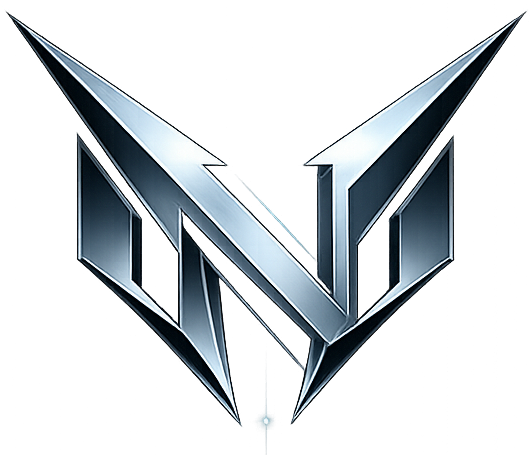

<div align="center">



# NOXIUM  
### *Anti-Forensics · Post-Quantum Encryption (PQC Based)*

[](https://www.python.org/)
[](#)
[](#)
[](#)
[](LICENSE)

**NOXIUM** is an advanced digital security suite focused on  
**deniable encryption**, **forensic invisibility**, and **absolute data sovereignty**.

Designed for hostile environments.

---

[ 🇺🇸 English ](#english)

</div>

---

<a name="english"></a>
## 🇺🇸 English — Technical Overview

NOXIUM enforces:
- No plaintext artifacts on disk
- No persistent encryption keys
- No recoverable metadata

All cryptographic material exists **only in volatile RAM** and is securely wiped after use.

---

### ⚛️ Cryptographic Engine

| Component | Description |
|---------|-------------|
| **Post-Quantum Cascade** | Hybrid encryption using `AES-256-GCM` + `ChaCha20-Poly1305` |
| **Deterministic Encryption** | `AES-SIV` — safe under IV reuse |
| **KDF** | `Scrypt` + `Argon2` (high memory cost) |
| **Hashing** | `SHA3-512` |
| **Legacy Support** | Blowfish-CTR, CAST5-CTR |

> **IMPORTANT:** All algorithms are implemented with explicit zero-memory cleanup.

---

### 🧠 Strategic Modules

#### 📂 Mission Control
- Encrypted SQLite index (metadata only)
- Lightning-fast global search
- Vault & session monitoring

#### 🛡️ Stealth & Anti-Forensics
- **Duress Password** → silent index annihilation
- **RAM-only sessions**
- **Steganography** (PNG LSB matching)
- **DoD 5220.22-M Shredder** (up to 35 passes , customizable in settings.)

#### 🧰 Omega Tools
- **Ghost Link (SFTP)** — encrypted remote vault transfer
- **Folder Watcher** — auto-encryption on file drop
- **Secure Journal** — encrypted markdown notes
- **`.vib` Vault Integrity Backups**

---

### 📊 Monitoring & Runtime Safety

- Real-time memory consumption
- Session lifespan tracking
- Encryption task status
- Index integrity checks

> ⚠️ If the process crashes — **keys die with RAM**

---

### 🏗️ Project Architecture
```
NOXIUM/
├── core/
│ ├── crypto_engine.py
│ ├── indexer.py
│ ├── auth.py
│ ├── vault_manager.py
│ ├── folder_watcher.py
│ ├── notes_manager.py
│ ├── backup_manager.py
│ └── shredder.py
├── gui/
│ └── app_qt.py
├── vaults/
└── main.py
```

## 🛠️ Installation

```bash
git clone https://github.com/Vyxara-Arch/NOXIUM.git
cd NOXIUM
pip install -r requirements.txt
python main.py
```


👥 Authors & Contributors
```
MintyExtremum — Core Cryptography
Vyxara-Arch — Architecture & UI
Blooder — Security Research & Testing
```
---

📜 License 
GNU GPLv3. This software is provided AS IS. Use responsibly. Freedom requires responsibility. check `LICENSE` for details.

---

<div align="center">
🔐 NOXIUM — Leave Nothing Behind · Created with <3
</div>
